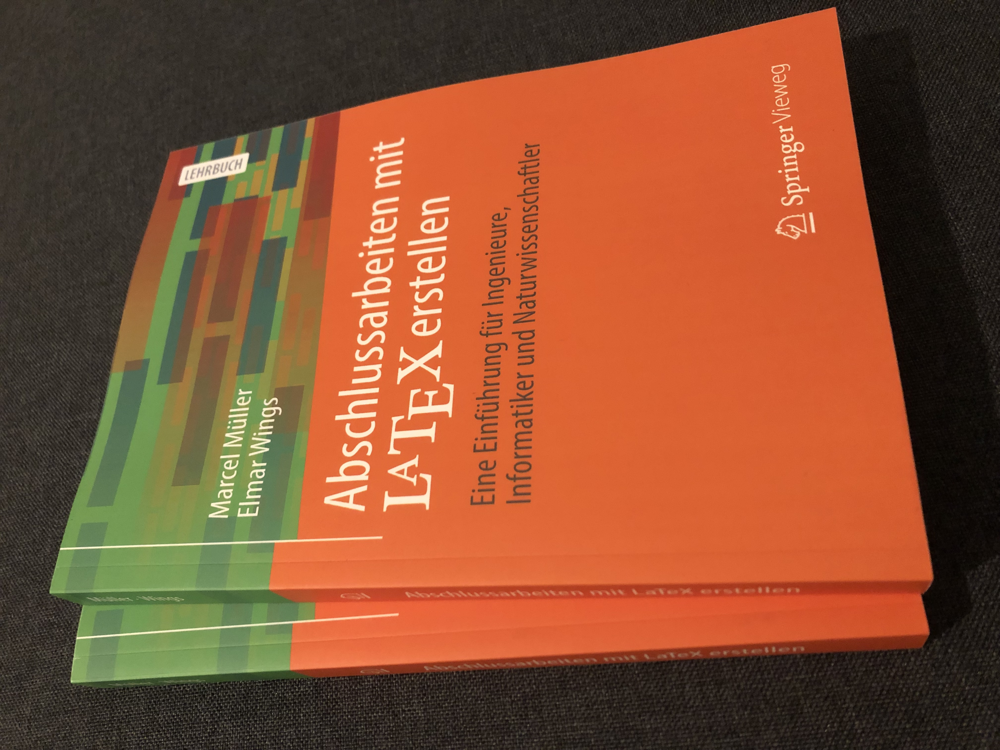

# Abschlussarbeiten mit LaTeX erstellen: Eine Einführung für Ingenieure, Informatiker und Naturwissenschaftler

Autoren: Marcel Müller & Elmar Wings

## Beschreibung zum Buch
Dieses Buch vermittelt die Grundlagen und das notwendige Spezialwissen, das zum Schreiben von wissenschaftlichen Abschlussarbeiten mit LaTeX erforderlich ist. Das schließt Bachelor- und Masterarbeiten sowie Dissertationen ein. Es eignet sich aber auch für die ersten Laborberichte, Studien- und Seminararbeiten.
Der Leser lernt die Funktionsweise von LaTeX und diverse Werkzeuge kennen. Zur Wissensvermittlung werden Quelltextbeispiele verwendet. Übungsaufgaben und Kontrollfragen am Ende der Kapitel helfen beim Vertiefen des Erlernten. Verweise auf weiterführende Literatur und auf die jeweiligen Paketbeschreibungen unterstützen den Leser dabei, sein Wissen über den Inhalt dieses Buches hinaus zu erweitern.
Das Ziel dieses Buches ist es, den Leser dahingehend zu befähigen, dass er effizient eine wissenschaftliche Abschlussarbeit in hoher typografischer Qualität mit LaTeX anfertigen kann, wenig Zeit in das Formatieren investieren muss und fokussiert am Inhalt arbeiten kann.

### Der Inhalt
Zu den Inhalten dieses Buches zählen unter anderem
* das Erstellen von Tabellen und eigenen Grafiken,
* das Einbinden und Referenzieren externer Abbildungen,
* das Hervorheben von Textstellen und Quelltexten,
* das Setzen von mathematischen Gleichungen,
* das Zitieren und Verwalten von Literatur,
* das Strukturieren der Abschlussarbeit und damit verbunden das Erstellen von Titelblättern und Verzeichnissen,
* das Anpassen des Seitenlayouts, was Kopf- und Fußzeilen sowie Seitenränder und Absatz-/Zeilenabstände einschließt.

[Zu SpringerLink](https://link.springer.com/book/10.1007/978-3-658-34430-6)

## Beschreibung zu diesem Repository
Das hier zur Verfügung gestellte Material ergänzt als Extra-/Zusatzmaterial das Buch "Abschlussarbeiten mit LaTeX erstellen - Eine Einführung für Ingenieure, Informatiker und Naturwissenschaftler". 
Das hier zur Verfügung gestellte Material ist, soweit nicht anders angegeben, lizenziert unter einer Creative Commons Attribution-ShareAlike 4.0 International Public License ([CC BY-SA 4.0](https://creativecommons.org/licenses/by-sa/4.0/)).
